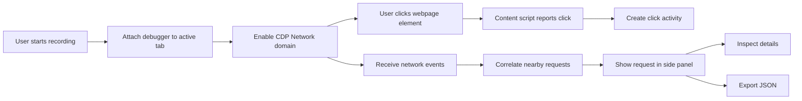

# ClickTrace Network Inspector

<p align="center">
  <strong>See what a webpage does on the network — without opening DevTools.</strong><br>
  Capture network activity in real time and correlate requests with the page interactions that triggered them.
</p>

<p align="center">
  
</p>

<p align="center">
  <a href="https://github.com/dev-maegor">
    
  </a>
  
  
  
  
</p>

---

## Overview

**ClickTrace Network Inspector** is a Microsoft Edge extension built as a lightweight developer tool for inspecting network activity directly from the browser.

It uses the browser's supported `debugger` API to access the DevTools Protocol **Network** domain while recording. The extension listens for page clicks and groups nearby network requests under the interaction that occurred immediately before them.

This makes it useful when you want to answer questions such as:

- What request did this button trigger?
- Which endpoint is called when I submit this form?
- What HTTP method and status did the request use?
- What request/response headers were involved?
- What request body was sent?
- How long did the request take?
- Which resource type and initiator were involved?

You can inspect the captured details in the extension's side panel and export the session as JSON.

---

## Features

### Real-time network capture

Start recording and ClickTrace enables the browser Network domain for the selected tab.

While recording, it receives events such as:

- `Network.requestWillBeSent`
- `Network.responseReceived`
- `Network.loadingFinished`
- `Network.loadingFailed`

### Click-to-request correlation

ClickTrace records page interactions and creates an activity entry for each click.

Requests observed within the configured correlation window are grouped under the most recent click.

Each activity entry can show:

- clicked element text;
- element tag;
- ID and classes;
- generated CSS selector;
- page URL;
- request count.

### Request inspection

Expand an individual request to inspect locally captured metadata including:

- HTTP method
- URL
- status code
- resource type
- request headers
- request body when exposed by the browser
- response headers
- MIME type
- initiator
- duration
- failure/error information
- response URL
- protocol
- encoded data length

### Developer-focused dashboard

The side panel is designed as a compact developer utility rather than a replacement for DevTools.

It includes:

- recording state;
- click/request/error counters;
- current page host;
- activity search;
- expandable click groups;
- expandable request details;
- clear session;
- JSON export.

### JSON export

Export the current captured session as a readable JSON file for:

- debugging;
- documentation;
- sharing with a development team;
- offline analysis;
- reproducing a network investigation.

> Treat exported captures as potentially sensitive. Requests can contain authentication headers, cookies, tokens, personal data, or request bodies.

---

## How it works



The extension does not open a separate DevTools window. The network events are consumed by the extension's background service worker and displayed in its Edge side panel.

---

## Installation

### Load the extension from source

1. Clone the repository:

   ```bash
   git clone https://github.com/dev-maegor/ClickTrace-Network-Inspector.git
   cd ClickTrace-Network-Inspector
   ```

2. Open Microsoft Edge.

3. Navigate to:

   ```text
   edge://extensions/
   ```

4. Enable **Developer mode**.

5. Select **Load unpacked**.

6. Select the repository folder.

7. Pin ClickTrace to the Edge toolbar if desired.

8. Open a normal `http` or `https` webpage.

9. Click the ClickTrace toolbar icon to open the side panel.

10. Select **Start recording** and interact with the page.

> If the repository is given a different name on GitHub, update the clone URL above.

---

## Project structure

```text
ClickTrace-Network-Inspector/
├── icons/
│   ├── icon16.png
│   ├── icon32.png
│   ├── icon48.png
│   └── icon128.png
│
├── src/
│   ├── background.js
│   ├── content.js
│   ├── sidepanel.html
│   ├── sidepanel.css
│   └── sidepanel.js
│
├── manifest.json
├── README.md
├── PRIVACY_POLICY_TEMPLATE.md
├── CONTRIBUTING.md
├── SECURITY.md
├── LICENSE
├── .gitignore
└── .gitattributes
```

### Components

| File | Responsibility |
|---|---|
| `src/background.js` | Debugger attachment, CDP Network events, request correlation, session state |
| `src/content.js` | Detects webpage clicks and sends click metadata to the service worker |
| `src/sidepanel.html` | Developer dashboard structure |
| `src/sidepanel.css` | Side panel UI |
| `src/sidepanel.js` | Dashboard state, rendering, filtering and JSON export |
| `manifest.json` | Manifest V3 configuration and permissions |
| `icons/` | Extension toolbar and store icons |

---

## Permissions

ClickTrace requests the following permissions:

| Permission | Purpose |
|---|---|
| `debugger` | Attach to the selected tab and receive Chrome DevTools Protocol Network events |
| `sidePanel` | Provide the persistent developer dashboard beside the webpage |
| `storage` | Available for local extension preferences/state |
| `<all_urls>` | Allow the click-capture content script to run on normal webpages |

### Why `debugger`?

The extension uses the browser's supported debugger API to access the DevTools Protocol Network domain without requiring the user to open DevTools manually.

The extension does **not** use a remote server to proxy or inspect network traffic.

---

## Privacy

ClickTrace is designed for local browser-based inspection.

Captured network information can include:

- URLs;
- HTTP methods;
- request and response headers;
- status codes;
- request bodies when exposed;
- initiators;
- timing information;
- page URLs;
- clicked-element metadata.

The extension does not transmit captured network data to a developer-controlled external server.

Captured data remains in extension runtime memory unless the user explicitly exports it.

See [`PRIVACY_POLICY_TEMPLATE.md`](PRIVACY_POLICY_TEMPLATE.md) for the privacy-policy draft.

### Important

Network captures can contain secrets.

Do **not** share exported captures containing:

- cookies;
- authorization headers;
- API keys;
- access tokens;
- passwords;
- personal information;
- private request bodies.

---

## Limitations

### Browser/internal pages

Pages such as:

```text
edge://...
chrome://...
about:...
```

are restricted by the browser and cannot be inspected like ordinary webpages.

### Correlation is not causation

ClickTrace associates requests with the most recent click when they occur within the configured correlation window.

This is a practical debugging aid, not proof that the click caused every request in the group.

Background polling, analytics, prefetching, service workers, and other asynchronous activity can overlap with a click.

### Request bodies

The browser may not expose every request body or every piece of network information.

### Cross-origin and browser security restrictions

Browser security boundaries can limit what information an extension can observe or associate with a webpage.

### Service worker lifetime

The extension uses a Manifest V3 service worker. Runtime state is therefore intended for the current inspection session rather than permanent archival storage.

---

## Development

ClickTrace is a Manifest V3 extension and does not require a build step.

After editing the source:

1. Open `edge://extensions/`.
2. Find ClickTrace.
3. Click **Reload**.
4. Reopen the side panel.
5. Test against several different websites.

### Suggested test cases

- [ ] Normal HTML page
- [ ] SPA with `fetch`
- [ ] Page using XHR
- [ ] Form submission
- [ ] Link navigation
- [ ] Failed request / 4xx / 5xx response
- [ ] Multiple requests from one click
- [ ] Requests that occur without a click
- [ ] Nested iframes
- [ ] Dynamic pages with background polling
- [ ] JSON export
- [ ] Clear and restart recording
- [ ] Debugger detach / tab close

---

## Contributing

Contributions and bug reports are welcome.

Before opening a pull request:

1. Keep the extension focused on network inspection and developer debugging.
2. Avoid adding permissions unless they are required.
3. Do not add remote executable code.
4. Test the debugger attach/detach lifecycle.
5. Test pages with different request patterns.
6. Update documentation when behavior changes.

See [`CONTRIBUTING.md`](CONTRIBUTING.md).

---

## Security

If you discover a security issue, please avoid publicly posting sensitive details before the issue has been reviewed.

See [`SECURITY.md`](SECURITY.md).

---

## Roadmap

Potential future improvements:

- [ ] Request filtering by method
- [ ] Status-code filtering
- [ ] Resource-type filtering
- [ ] Domain filtering
- [ ] Copy request as cURL
- [ ] Request/response search
- [ ] HAR export
- [ ] Persistent session history
- [ ] Optional pause/resume capture
- [ ] More detailed timing breakdowns

---

## Creator

Built by **[dev-maegor](https://github.com/dev-maegor)** for developer workflow and personal debugging.

---

## License

Released under the [MIT License](LICENSE).
